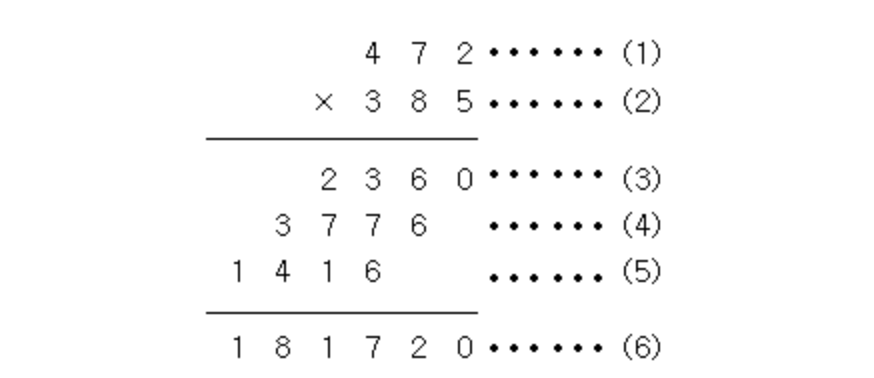

# 단계별_입출력과 사칙연산

----

----


# 2557. Hello World

#### Q. Hello World!를 출력하시오.

``` python
print("Hello World!")
```


-----


# 10718. We love kriii

##### ACM-ICPC 인터넷 예선, Regional, 그리고 World Finals까지 이미 2회씩 진출해버린 kriii는 미련을 버리지 못하고 왠지 모르게 올해에도 파주 World Finals 준비 캠프에 참여했다. 대회를 뜰 줄 모르는 지박령 kriii를 위해서 격려의 문구를 출력해주자.

#### 두 줄에 걸쳐 "강한친구 대한육군"을 한 줄에 한 번씩 출력한다.


----


# 10171. 고양이

#### 아래 예제와 같이 고양이를 출력하시오.

``` python
\    /\
 )  ( ')
(  /  )
 \(__)|
```


----


# 10172. 개

#### 아래 예제와 같이 개를 출력하시오.

``` python
|\_/|
|q p|   /}
( 0 )"""\
|"^"`    |
||_/=\\__|
```


----


# 1000. A+B

#### 두 정수 A와 B를 입력받은 다음, A+B를 출력하는 프로그램을 작성하시오.

첫째 줄에 A와 B가 주어진다. (0 < A, B < 10)

첫째 줄에 A+B를 출력한다.

``` python
1 2

#3
```


---


# 1001. A-B

#### 두 정수 A와 B를 입력받은 다음, A-B를 출력하는 프로그램을 작성하시오.

첫째 줄에 A와 B가 주어진다. (0 < A, B < 10)

첫째 줄에 A+B를 출력한다.

``` python
3 2 
#1
```


----


# 10998. A*B

#### 두 정수 A와 B를 입력받은 다음, A*B를 출력하는 프로그램을 작성하시오.

첫째 줄에 A와 B가 주어진다. (0 < A, B < 10)

첫째 줄에 A*B를 출력한다.

``` python
1 2
#2

3 4
#12
```


---

 

# 1008. A/B

#### 두 정수 A와 B를 입력받은 다음, A/B를 출력하는 프로그램을 작성하시오.

첫째 줄에 A와 B가 주어진다. (0 < A, B < 10)

첫째 줄에 A*B를 출력한다.

``` python
1 3
#0.33333333333333333333333333333333

4 5
#0.8
```


----


# 10869. 사칙연산

#### 두 자연수 A와 B가 주어진다. 이때, A+B, A-B, A*B, A/B(몫), A%B(나머지)를 출력하는 프로그램을 작성하시오.

두 자연수 A와 B가 주어진다. (1 ≤ A, B ≤ 10,000)

첫째 줄에 A+B, 둘째 줄에 A-B, 셋째 줄에 A*B, 넷째 줄에 A/B, 다섯째 줄에 A%B를 출력한다.

``` python
7 3

#10
#4
#21
#2
#1
```


----


# 10926. ??!

#### 준하는 사이트에 회원가입을 하다가 joonas라는 아이디가 이미 존재하는 것을 보고 놀랐다. 준하는 놀람을 ??!로 표현한다. 준하가 가입하려고 하는 사이트에 이미 존재하는 아이디가 주어졌을 때, 놀람을 표현하는 프로그램을 작성하시오.

``` python
joonas
#joonas??!
```

 

----


# 18108. 1998년생인 내가 태국에서는 2541년생?!

#### ICPC Bangkok Regional에 참가하기 위해 수완나품 국제공항에 막 도착한 팀 레드시프트 일행은 눈을 믿을 수 없었다. 공항의 대형 스크린에 올해가 2562년이라고 적혀 있던 것이었다.

#### 불교 국가인 태국은 불멸기원(佛滅紀元), 즉 석가모니가 열반한 해를 기준으로 연도를 세는 불기를 사용한다. 반면, 우리나라는 서기 연도를 사용하고 있다. 불기 연도가 주어질 때 이를 서기 연도로 바꿔 주는 프로그램을 작성하시오.

서기 연도를 알아보고 싶은 불기 연도 *y*가 주어진다. (1000 ≤ *y* ≤ 3000)

불기 연도를 서기 연도로 변환한 결과를 출력한다.

``` python
2541

#1998
```


----


# 10430. 나머지 

#### (A+B)%C는 ((A%C) + (B%C))%C 와 같을까?

#### (A×B)%C는 ((A%C) × (B%C))%C 와 같을까?

#### 세 수 A, B, C가 주어졌을 때, 위의 네 가지 값을 구하는 프로그램을 작성하시오.

첫째 줄에 A, B, C가 순서대로 주어진다. (2 ≤ A, B, C ≤ 10000)

첫째 줄에 (A+B)%C, 둘째 줄에 ((A%C) + (B%C))%C, 셋째 줄에 (A×B)%C, 넷째 줄에 ((A%C) × (B%C))%C를 출력한다.

``` python
5 8 4

#1
#1
#0
#0
```


---


# 2588. 곱셈

#### (세 자리 수) × (세 자리 수)는 다음과 같은 과정을 통하여 이루어진다.



#### (1)과 (2)위치에 들어갈 세 자리 자연수가 주어질 때 (3), (4), (5), (6)위치에 들어갈 값을 구하는 프로그램을 작성하시오.

첫째 줄에 (1)의 위치에 들어갈 세 자리 자연수가, 둘째 줄에 (2)의 위치에 들어갈 세자리 자연수가 주어진다.

첫째 줄부터 넷째 줄까지 차례대로 (3), (4), (5), (6)에 들어갈 값을 출력한다.

``` python
472
385

#2360
#3776
#1416
#181720
```


